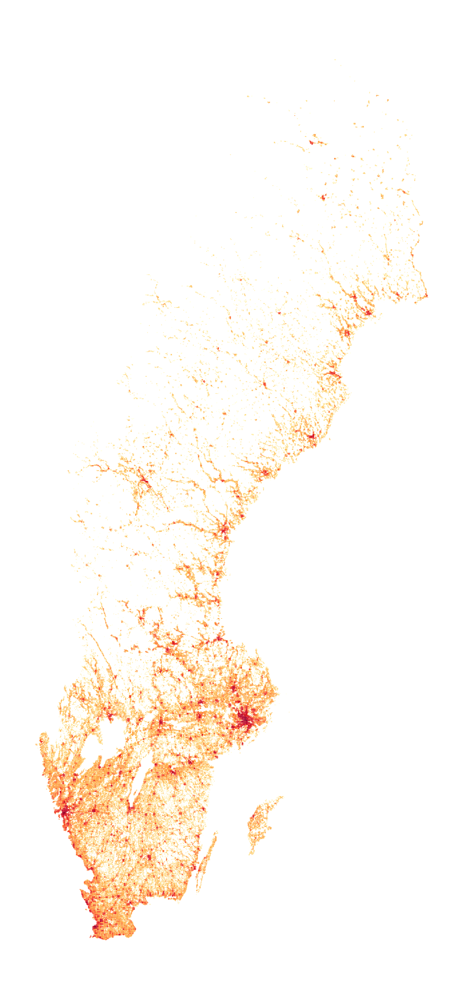
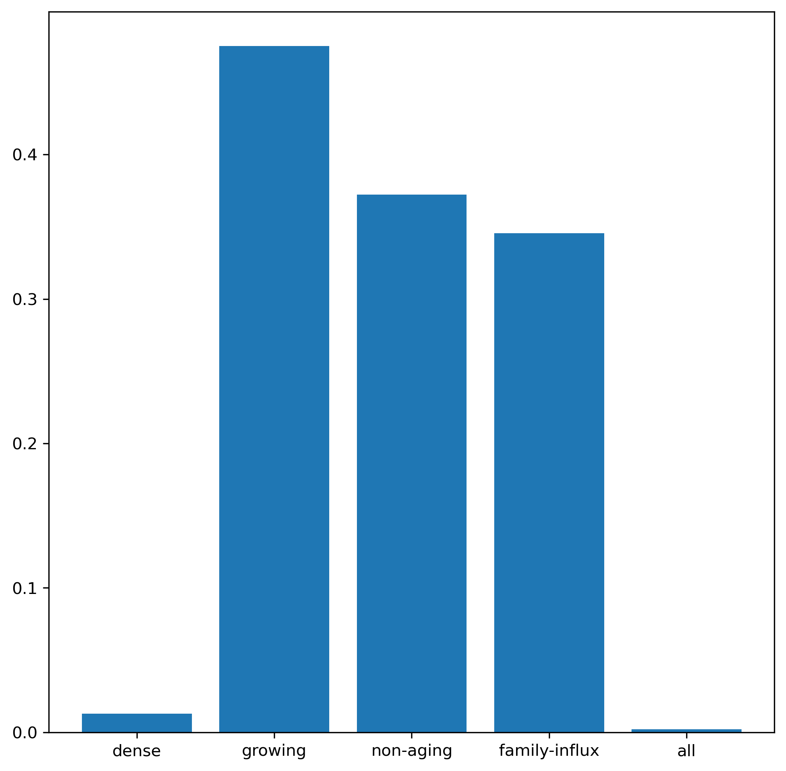
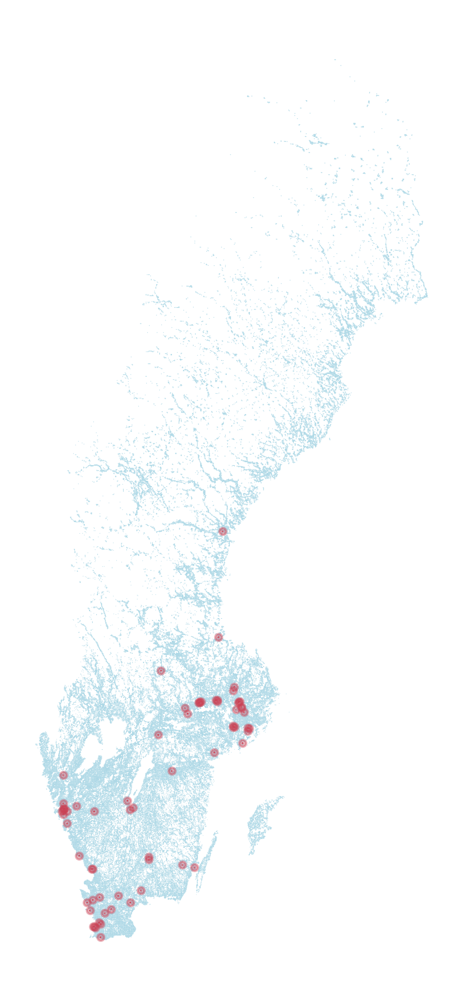
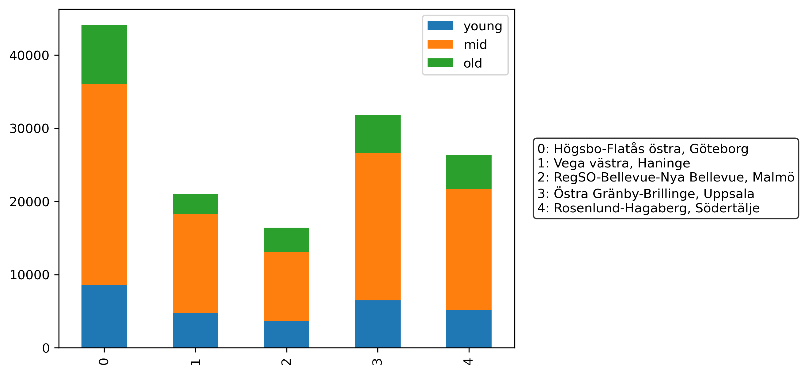
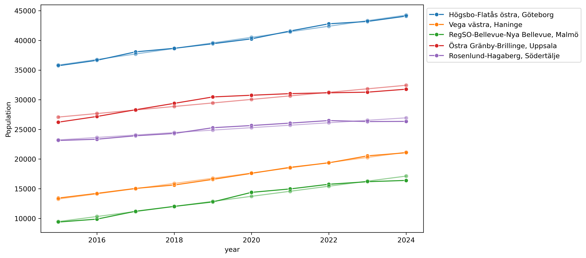

# Demographic Data Analysis for Retail
## Johan Slettengren

---

**Data cleaning and aggregation**

---

**Population density across Sweden**

---

**Conditions**

- Population density: at least 5000 people in a 5km^2 square
- Growing population: positive linear slope over past 10 years
- Non-aging population: share of 65+ not growing over past 10 years
- Family-influx: population of young children growing over past 10 years

---

**Percentage of areas that fullfill the criteria**

---
**Spread of areas that fullfill all the criteria**

---

**Allocation of candidate areas across municipalities**

---

**Allocation and customer mix for top 5 candidates**

---

**Historical evolution and linear interpolation**

---

See the Marpit Markdown syntax [here](https://marpit.marp.app/markdown).